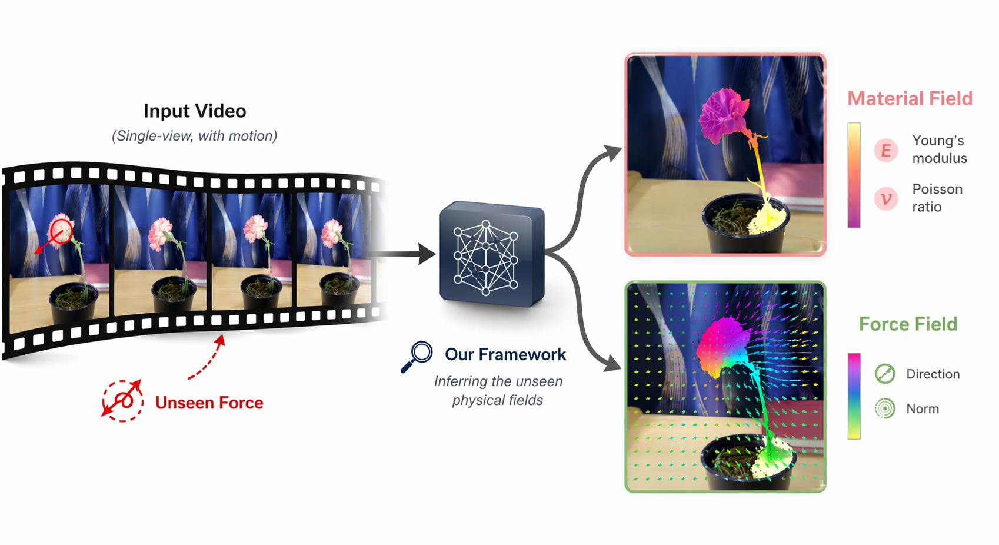

# PhysFields

**See the Unseen from Single-view Videos**

  
  
  

  

## About

A unified end-to-end differentiable framework that simultaneously recovers **force fields** and **material fields** from a single video. We combine a 3D Gaussian Splatting reconstruction of the first frame with a differentiable Material Point Method simulator, with material parameters initialized by a Vision-Language Model. The whole pipeline is optimized directly from the input video using only pixel-level reconstruction losses (MSE + SSIM) — no proxy supervision required.

By **Jun Dai** and **Sheng Zhao** — Machine Vision Course Project, Tsinghua University.

## Visit the Project Page

  

  Scan the QR code, or click <a href="https://daijun10086.github.io/PhysFields/"><strong>here</strong></a> to open the project page.

## Repository Contents

This repository hosts the source of the project page deployed via GitHub Pages. It contains:

- `index.html` — the project page
- `static/css/` — page styles
- `static/images/` — teaser, pipeline figure, and result figures
- `static/pdfs/` — the paper PDF
- `static/ppt/` — presentation slide decks

The source code of the method itself is maintained separately.
